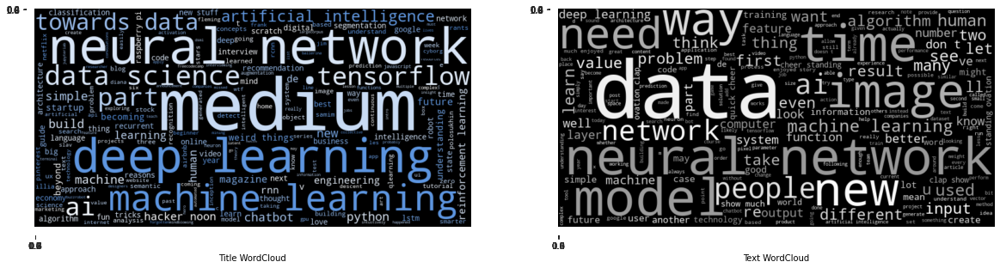
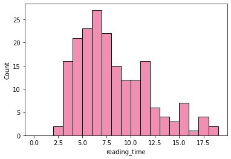
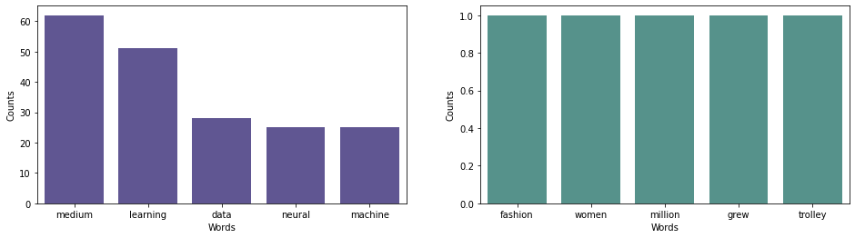
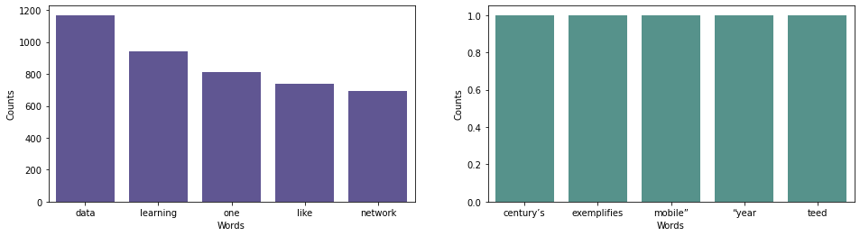

# Medium Articles EDA

In this project `intense EDA` is performed on [Medium Articles](https://www.kaggle.com/hsankesara/medium-articles) by [Hsankesara](https://www.kaggle.com/hsankesara) where he dataset contains `articles`, their `title`, `number of claps` it has received, their `links` and their `reading time`.

**While doing this we'll go through:**

- Preprocessing of text data
- Removing outliers using `IQR` and `z-score` methods
- Data visualization using `seaborn` and `word cloud`
- Building `classes` following the `DRY` convention

During `EDA` we'll use the preprocessed data to answer different questions.

## Table of contents

- [Getting started](#getting-started)
- [Findings](#findings)
- [License](#license)

## Getting started

The [notebook](https://www.kaggle.com/akashsdas/medium-articles-eda/data) is available on Kaggle to work in the same environment where this `notebook` was created i.e. use the same version packages used, etc...

## Findings

`Claps` on article and its `reading time` have a `pearson correleation coefficient` of `0.326` which is `low positive correlation`.

The average reading ⏰ time of an article is 7.75mins.

**Most and least words used in title**

**Most and least words used in text**

To know more about finding go to the [notebook](./notebook.ipynb).

## License

[APACHE LICENSE, VERSION 2.0](./LICENSE)
